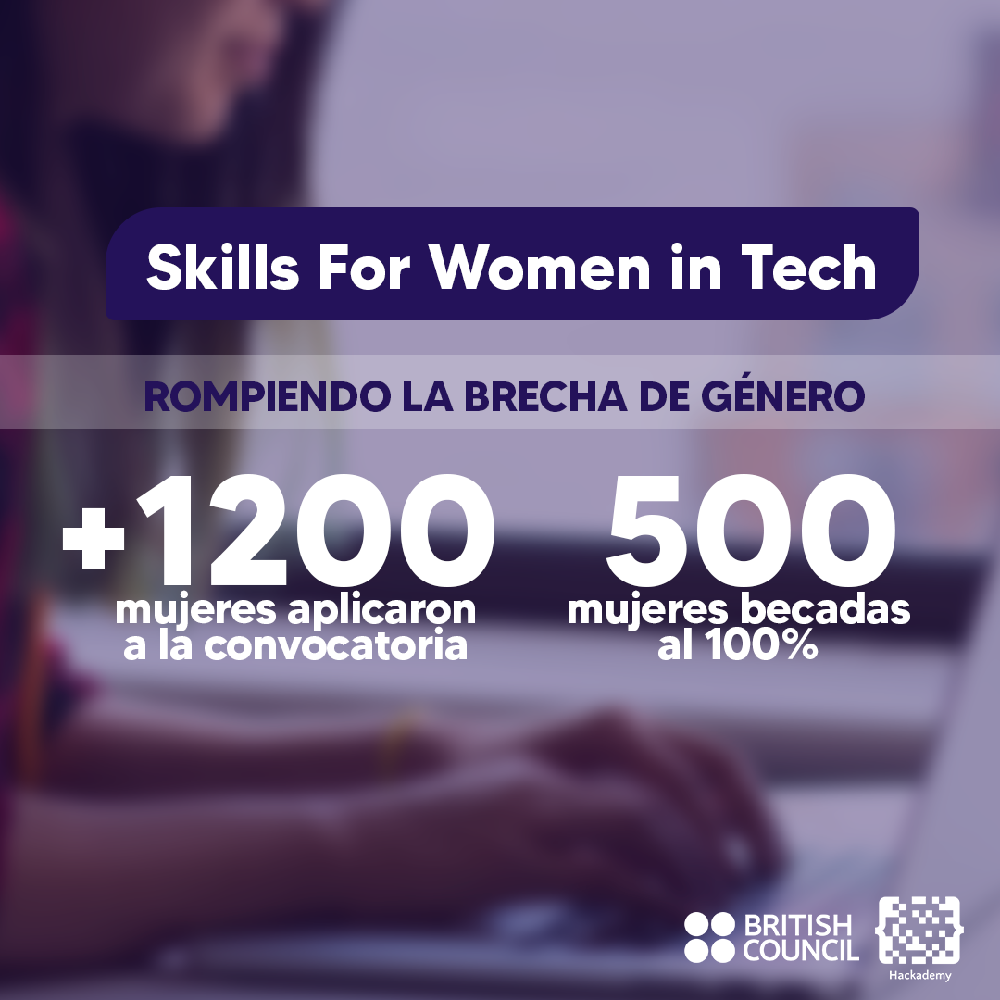

# Introduccion a GitHub

## Charla-Taller

Taller desarrollado por el **Google Developer Student Club de la Universidad de Guanajuato** en colaboración por parte del programa _**SKILLS FOR WOMEN IN TECH**_ y junto a **BRITISH COUNCIL** para la capacitación-actualización de un grupo de estudiantes y profesores de la Casa de Estudios.
Sesion de github.

## Insertamos una imagen

